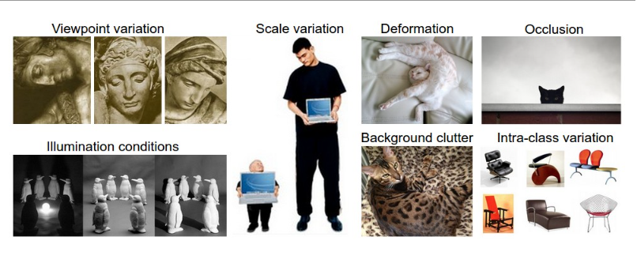
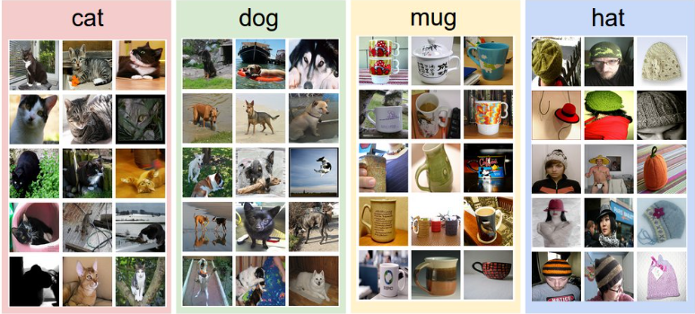
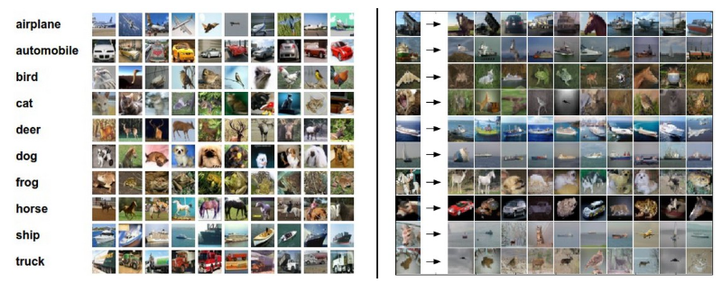
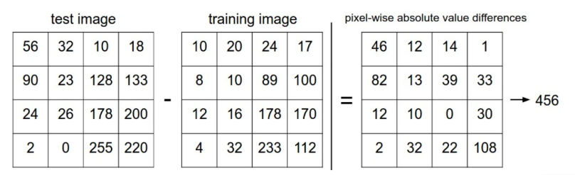

## CCS231n 第一节：图像分类问题
>Good good study, day day up.

[课程网站](https://cs231n.github.io/classification/)

学习分享基于**斯坦福李飞飞老师cs231n计算机视觉课程**  

[阅读材料](https://cs231n.github.io/classification/) 

# 0 图片分类问题 

图片分类问题，即从事先给定的一个类别组中，辨认选定输入图片的类别。  
这是计算机视觉的一个核心问题，且有很广泛的实际应用。  
许多计算机视觉的问题最终会简化为图片分类问题。 

**Example.** 假设有一个图片分类模型，它对于输入的三通道的图片会预测其属于 4 个标签（label）{cat， dog， hat， mug} 的概率。  

对于计算机来说，图像表示为一个大型的 3 维数字数组。在本示例中，cat 图像宽 248 像素，高 400 像素，具有三个颜色通道 Red、Green、Blue（简称 RGB）。因此，该图像由 248 x 400 x 3 ，共 297,600 个数字组成。每个数字都是一个范围从 0（黑色）到 255（白色）的整数。  

模型的任务就是接收这些数字，然后预测出这些数字代表的标签（label）,如 “cat”。  


# 1 数据驱动方法

## 1.1 Challenges

虽然图片识别对于容量来说平常简单，但是对于计算机来说，由于接受的是一串数字，对于同一个物体，对应表示这个物体的数字可能会有很大不同，所以通过算法来实现这一任务存在许多挑战，具体来说：

1. **观察角度变化 Viewpoint variation**：“不识庐山真面目，只缘身在此山中”。  
2. **尺度变换 Scale variation**：图片大小比例的变化也会使得数据发生改变。  
3. **变形 Deformation**：很多物体不是刚体，可以以极端方式变形，比如猫是液体。  
4. **遮挡 Occlusion**：要被识别的物体可能被遮挡，仅一部分可见。  
5. **光线条件 Illumination conditions**：环境光线的变化对图片的影响是巨大的。  
6. **背景干扰 Background clutter**：物体和背景可能有相似的颜色和纹路，使其很难被识别。  
7. **类内差异 Intra-class variation**：同一种类的物品可能外观差异很大。  


## 1.2 Data-driven approach

那么我们如何设计一种可以将图像分类为不同类别的算法？  
我们将大量带有类别标签的数据提供给计算机，开发学习算法模型来查看这些示例并了解每个类的视觉外观。这种方式就成为数据驱动方法，因为它依赖于一个带有标签的数据集合。  

所以通常图片识别任务的流水线如下：  
- **输入**：输入 $N$ 张图片，每张图像都标有 $K$ 个不同类别中的一个（图片的总类别数量为 $K$），我们称这一部分的数据为**训练集**。  
- **学习**：使用模型在训练集中学习，提取每一个类别的特征。我们将此步骤称为**训练分类器**或**学习模型**。  
- **评估**：最后，我们需要评估训练后这个模型的好坏。运用分类器预测一组以前从未见过的新图像的标签（保证类别也在 $K$ 类之中）来评估分类器的质量，我们将这些图像的真实标签与分类器预测的标签进行比较，期望分类正确的图片越多越好。    
   

# 2 Nearest Neighbor Classifier 最近邻域分类器

## 2.1 数据集和原理

首先我们来介绍一下最近邻域分类器，这个分类器与卷积神经网络无关，在实践中很少使用，但它可以让我们了解图像分类问题的基本方法。  

**Example.**  
本次使用的数据集是 [CIFAR-10](https://www.cs.toronto.edu/~kriz/cifar.html)，这是一个有名的公开图片数据集，由 60,000 张长和宽均为 32 像素的图片组成，一共有 10 个种类（如飞机、汽车、鸟等）。  
一般我们将其中的 50,000 张作为训练集， 10,000 张作为测试集，下图左就是 10 个类别的部分图片。  
  

现在我们的训练集中有 50,000 张图片（每个类别 5,000 张），对于测试集的 10,000 张图片，我们要做的是将其与训练集中的每一张图片进行比较，然后将该图片与训练集中最相似的图片归为一类。  
上图右就是部分图片分类后的结果，可以发现，存在很多的错误分类，原因在于虽然图片的种类不同，但是两种图片的颜色图案等非常相似，因此容易被归为一类。    

在最近邻域算法中，衡量两张图片是否相近的标准是什么呢？  
一种最简单的标准就是 **L1 距离** $L1$ $distance$（逐个像素地比较图片，然后把所有的差异相加）。  
假设我们将两张图片分别表示为两个向量 $I_1$, $I_2$，那么 $L1$ 距离 $L1$ $distance$的定义如下：  

$$d_1(I_1, I_2) = \sum_{p} |I_1^p - I_2^p|$$  

一个简单的计算流程演示：  
  

 对于两种图片的衡量标准还有 $L2$ 距离 $L2$ $distance$，定义如下：  
$$d_2(I_1, I_2) = \sqrt{\sum_{p} (I_1^p - I_2^p)^2}$$  

## 2.2 代码实现

我们看看如何在代码中实现分类器。  
首先我们需要处理 CIFAR-10 数据集，将 CIFAR-10 数据作为 4 个数组加载到内存中，分别为 **训练集数据、训练集标签、测试集数据、测试集标签**。  
在下面的代码中，Xtr表示训练集数据，（大小为 50,000 x 32 x 3）包含训练集中的所有图像；Ytr 表示训练集标签，相应的一维数组（长度为 50,000）包含训练标签（从 0 到 9），得到数据后将其拉成一维向量，便于计算。  
```python
		Xtr, Ytr, Xte, Yte = load_CIFAR10('data/cifar10/')   
		# a magic function we provide flatten out all images to be one-dimensional  
		Xtr_rows = Xtr.reshape(Xtr.shape[0], 32 * 32 * 3)   
		# Xtr_rows becomes 50000 x 3072  
		Xte_rows = Xte.reshape(Xte.shape[0], 32 * 32 * 3)   
		# Xte_rows becomes 10000 x 3072  
```

现在我们已经将所有图像拉伸为行，下面是训练和评估模型的方法：  
```python
		nn = NearestNeighbor() # create a Nearest Neighbor classifier class  
		nn.train(Xtr_rows, Ytr) # train the classifier on the training images and labels  
		Yte_predict = nn.predict(Xte_rows) # predict labels on the test images  
		print 'accuracy: %f' % ( np.mean(Yte_predict == Yte) )  
```

请注意，通常使用**准确度**作为评估标准，准确度用于衡量正确预测的比例。  
请注意，我们将构建的所有分类器都满足这个通用 API：它们有一个函数，该函数获取数据和标签以供学习。在内部，该类应该构建某种标签模型以及如何通过数据预测它们。然后有一个函数，它获取新数据并预测标签。当然，我们省略了事物的实质 - 实际的分类器本身。  
下面是一个简单的 Nearest Neighbor 分类器的实现，其 $L1$ 距离满足此模板：  
```train(X,y)```	```predict(X)```    
```python
import numpy as np  
 
class NearestNeighbor(object):  
	def __init__(self):  
		pass  
	
	def train(self, X, y):  
    	""" X is N x D where each row is an example. Y is 1-dimension of size N """  
	# the nearest neighbor classifier simply remembers all the training data  
    		self.Xtr = X  
    		self.ytr = y  
 
  	def predict(self, X):  
    	""" X is N x D where each row is an example we wish to predict label for """  
    		num_test = X.shape[0]  
    		# lets make sure that the output type matches the input type  
    		Ypred = np.zeros(num_test, dtype = self.ytr.dtype)  
 
    		# loop over all test rows  
    		for i in range(num_test):  
      		# find the nearest training image to the i'th test image  
      		# using the L1 distance (sum of absolute value differences)  
      		distances = np.sum(np.abs(self.Xtr - X[i,:]), axis = 1)  
      		min_index = np.argmin(distances) # get the index with smallest distance  
      		Ypred[i] = self.ytr[min_index] # predict the label of the nearest example  
 
    		return Ypred  
```
运行此代码，我们将看到此分类器在 CIFAR-10 上的准确率仅达 38.6%，这比随机猜测效果更好（因为有 10 个类，所以会得到 10% 的准确率），但远不及人类的表现（估计约为 94%），也远不及最先进的卷积神经网络，后者达到约 95%，与人类的准确率相当（参见最近在 CIFAR-10 上举行的 Kaggle 竞赛的排行榜）。  

如果要是用 $L2$ 距离，则只需要将距离计算公式改写为  
```distances = np.sqrt(np.sum(np.square(self.Xtr - X[i,:]), axis = 1))```  

$L1$ 和 $L2$ 距离比较：在某一维度上，如果两个点相距较远，则$L2$距离比$L1$距离更大，若两个点相距很近，则反之，这是平方导致的,因此$L2$距离对距离差异的容忍度更差。  
