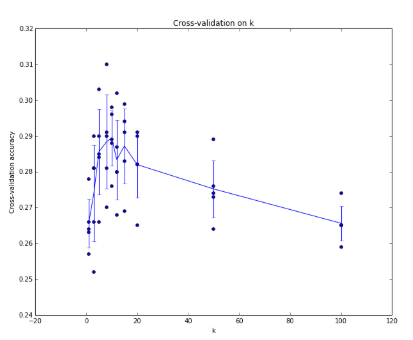
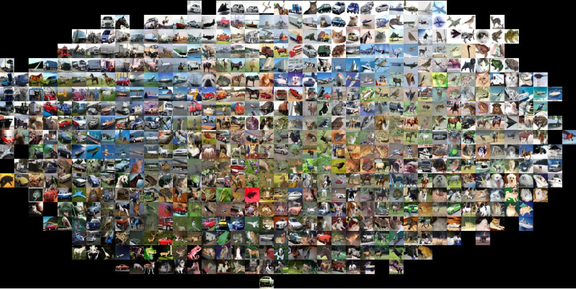

## CCS231n 第一节：图像分类问题
>Good good study, day day up.

[课程网站](https://cs231n.github.io/classification/)

学习分享基于**斯坦福李飞飞老师cs231n计算机视觉课程**  

[阅读材料](https://cs231n.github.io/classification/) 

# 0 图片分类问题 

图片分类问题，即从事先给定的一个类别组中，辨认选定输入图片的类别。  
这是计算机视觉的一个核心问题，且有很广泛的实际应用。  
许多计算机视觉的问题最终会简化为图片分类问题。 

**Example.** 假设有一个图片分类模型，它对于输入的三通道的图片会预测其属于 4 个标签（label）{cat， dog， hat， mug} 的概率。  

对于计算机来说，图像表示为一个大型的 3 维数字数组。在本示例中，cat 图像宽 248 像素，高 400 像素，具有三个颜色通道 Red、Green、Blue（简称 RGB）。因此，该图像由 248 x 400 x 3 ，共 297,600 个数字组成。每个数字都是一个范围从 0（黑色）到 255（白色）的整数。  

模型的任务就是接收这些数字，然后预测出这些数字代表的标签（label）,如 “cat”。  


# 1 数据驱动方法

## 1.1 Challenges

虽然图片识别对于容量来说平常简单，但是对于计算机来说，由于接受的是一串数字，对于同一个物体，对应表示这个物体的数字可能会有很大不同，所以通过算法来实现这一任务存在许多挑战，具体来说：

1. **观察角度变化 Viewpoint variation**：“不识庐山真面目，只缘身在此山中”。  
2. **尺度变换 Scale variation**：图片大小比例的变化也会使得数据发生改变。  
3. **变形 Deformation**：很多物体不是刚体，可以以极端方式变形，比如猫是液体。  
4. **遮挡 Occlusion**：要被识别的物体可能被遮挡，仅一部分可见。  
5. **光线条件 Illumination conditions**：环境光线的变化对图片的影响是巨大的。  
6. **背景干扰 Background clutter**：物体和背景可能有相似的颜色和纹路，使其很难被识别。  
7. **类内差异 Intra-class variation**：同一种类的物品可能外观差异很大。  


## 1.2 Data-driven approach

那么我们如何设计一种可以将图像分类为不同类别的算法？  
我们将大量带有类别标签的数据提供给计算机，开发学习算法模型来查看这些示例并了解每个类的视觉外观。这种方式就成为数据驱动方法，因为它依赖于一个带有标签的数据集合。  

所以通常图片识别任务的流水线如下：  
- **输入**：输入 $N$ 张图片，每张图像都标有 $K$ 个不同类别中的一个（图片的总类别数量为 $K$），我们称这一部分的数据为**训练集**。  
- **学习**：使用模型在训练集中学习，提取每一个类别的特征。我们将此步骤称为**训练分类器**或**学习模型**。  
- **评估**：最后，我们需要评估训练后这个模型的好坏。运用分类器预测一组以前从未见过的新图像的标签（保证类别也在 $K$ 类之中）来评估分类器的质量，我们将这些图像的真实标签与分类器预测的标签进行比较，期望分类正确的图片越多越好。    
   

# 2 Nearest Neighbor Classifier 最近邻域分类器

## 2.1 数据集和原理

首先我们来介绍一下最近邻域分类器，这个分类器与卷积神经网络无关，在实践中很少使用，但它可以让我们了解图像分类问题的基本方法。  

**Example.**  
本次使用的数据集是 [CIFAR-10](https://www.cs.toronto.edu/~kriz/cifar.html)，这是一个有名的公开图片数据集，由 60,000 张长和宽均为 32 像素的图片组成，一共有 10 个种类（如飞机、汽车、鸟等）。  
一般我们将其中的 50,000 张作为训练集， 10,000 张作为测试集，下图左就是 10 个类别的部分图片。  
  

现在我们的训练集中有 50,000 张图片（每个类别 5,000 张），对于测试集的 10,000 张图片，我们要做的是将其与训练集中的每一张图片进行比较，然后将该图片与训练集中最相似的图片归为一类。  
上图右就是部分图片分类后的结果，可以发现，存在很多的错误分类，原因在于虽然图片的种类不同，但是两种图片的颜色图案等非常相似，因此容易被归为一类。    

在最近邻域算法中，衡量两张图片是否相近的标准是什么呢？  
一种最简单的标准就是 **L1 距离** $L1$ $distance$（逐个像素地比较图片，然后把所有的差异相加）。  
假设我们将两张图片分别表示为两个向量 $I_1$, $I_2$，那么 $L1$ 距离 $L1$ $distance$的定义如下：  

$$d_1(I_1, I_2) = \sum_{p} |I_1^p - I_2^p|$$  

一个简单的计算流程演示：  
  

 对于两种图片的衡量标准还有 $L2$ 距离 $L2$ $distance$，定义如下：  
$$d_2(I_1, I_2) = \sqrt{\sum_{p} (I_1^p - I_2^p)^2}$$  

## 2.2 代码实现

我们看看如何在代码中实现分类器。  
首先我们需要处理 CIFAR-10 数据集，将 CIFAR-10 数据作为 4 个数组加载到内存中，分别为 **训练集数据、训练集标签、测试集数据、测试集标签**。  
在下面的代码中，Xtr表示训练集数据，（大小为 50,000 x 32 x 3）包含训练集中的所有图像；Ytr 表示训练集标签，相应的一维数组（长度为 50,000）包含训练标签（从 0 到 9），得到数据后将其拉成一维向量，便于计算。  
```
Xtr, Ytr, Xte, Yte = load_CIFAR10('data/cifar10/')   
# a magic function we provide flatten out all images to be one-dimensional   
Xtr_rows = Xtr.reshape(Xtr.shape[0], 32 * 32 * 3)   
# Xtr_rows becomes 50000 x 3072   
Xte_rows = Xte.reshape(Xte.shape[0], 32 * 32 * 3)   
# Xte_rows becomes 10000 x 3072     
```

现在我们已经将所有图像拉伸为行，下面是训练和评估模型的方法：  
```
nn = NearestNeighbor() # create a Nearest Neighbor classifier class   
nn.train(Xtr_rows, Ytr) # train the classifier on the training images and labels   
Yte_predict = nn.predict(Xte_rows) # predict labels on the test images   
print 'accuracy: %f' % ( np.mean(Yte_predict == Yte) )   
```

请注意，通常使用**准确度**作为评估标准，准确度用于衡量正确预测的比例。  
请注意，我们将构建的所有分类器都满足这个通用 API：它们有一个函数，该函数获取数据和标签以供学习。在内部，该类应该构建某种标签模型以及如何通过数据预测它们。然后有一个函数，它获取新数据并预测标签。当然，我们省略了事物的实质 - 实际的分类器本身。  
下面是一个简单的 Nearest Neighbor 分类器的实现，其 $L1$ 距离满足此模板：  
```train(X,y)```	```predict(X)```    
```
import numpy as np   
 
class NearestNeighbor(object):   
	def __init__(self):   
		pass   
	
	def train(self, X, y):   
    	""" X is N x D where each row is an example. Y is 1-dimension of size N """   
	# the nearest neighbor classifier simply remembers all the training data   
		self.Xtr = X   
		self.ytr = y   
 
  	def predict(self, X):   
    	""" X is N x D where each row is an example we wish to predict label for """   
    		num_test = X.shape[0]   
    		# lets make sure that the output type matches the input type   
		Ypred = np.zeros(num_test, dtype = self.ytr.dtype)   
 
    		# loop over all test rows   
		for i in range(num_test):   
      		# find the nearest training image to the i'th test image   
		# using the L1 distance (sum of absolute value differences)   
		distances = np.sum(np.abs(self.Xtr - X[i,:]), axis = 1)   
      		min_index = np.argmin(distances) # get the index with smallest distance   
		Ypred[i] = self.ytr[min_index] # predict the label of the nearest example   

		return Ypred   
```
运行此代码，我们将看到此分类器在 CIFAR-10 上的准确率仅达 38.6%，这比随机猜测效果更好（因为有 10 个类，所以会得到 10% 的准确率），但远不及人类的表现（估计约为 94%），也远不及最先进的卷积神经网络，后者达到约 95%，与人类的准确率相当（参见最近在 CIFAR-10 上举行的 Kaggle 竞赛的排行榜）。  

如果要是用 $L2$ 距离，则只需要将距离计算公式改写为  
```distances = np.sqrt(np.sum(np.square(self.Xtr - X[i,:]), axis = 1))```  

$L1$ 和 $L2$ 距离比较：在某一维度上，如果两个点相距较远，则$L2$距离比$L1$距离更大，若两个点相距很近，则反之，这是平方导致的,因此$L2$距离对距离差异的容忍度更差。  

## 2.3 K-邻近邻域算法（KNN）

可以注意到，最近邻域算法只关注和预测图片最相近的一张训练集中的图片。  
不同于最近邻域算法，KNN算法会关注与预测图片**最相近的 $k$ 张图片**，如果 $k$=1 则KNN就是最近邻域算法，这里的 $k$ 是**超参数**，由我们自己设置。  
具体的流程是，分别计算预测样本和训练集中所有数据的距离，取前 $k$ 个距离最相近的，应用投票法，票数最多的就当做预测种类。直观地说，较高的 $k$ 值具有**平滑效果**，使分类器更能抵抗异常值。  
如下图所示，左边的是原始数据，一共有三种类别，分别用三种颜色表示;中间是NN分类器;右边是5-NN分类器，可以看到有很多空白的部分（表示这些地方属于模糊不清的，即投票结果至少有两个种类相同）。  
  

## 2.4 超参数选择

所有需要我们自行选择的，而不是由算法自学习得到的参数都是超参数，比如 KNN 中 $k$ 的选择以及使用 L1 还是 L2 距离，这些都属于超参数。  
超参数对模型好坏的影响巨大，最简单的办法就是选择所有超参数的可能组合，然后逐一验证优劣，选择最有效的一组超参数。  
但是需要注意的是，我们**不能使用测试集或者训练集来调整超参数**，因为会有**过拟合的风险**。每当设计机器学习算法时，都应该将测试集视为非常宝贵的资源，理想情况下，在最后的一次之前，它不应该被触及。  
因此我们需要一组新的数据，我们称为**验证集**，一般是从训练集中划分出一部分作为验证集。以 CIFAR-10 为例，例如，我们可以使用 49,000 张训练图像进行训练，并留出 1,000 张用于验证。**测试集只能在整个训练过程的最后使用一次**。  

下面是选择超参数 $k$ 的过程：  
```
# assume we have Xtr_rows, Ytr, Xte_rows, Yte as before   
# recall Xtr_rows is 50,000 x 3072 matrix   
Xval_rows = Xtr_rows[:1000, :] # take first 1000 for validation   
Yval = Ytr[:1000]   
Xtr_rows = Xtr_rows[1000:, :] # keep last 49,000 for train   
Ytr = Ytr[1000:]   
 
# find hyperparameters that work best on the validation set   
validation_accuracies = []   
for k in [1, 3, 5, 10, 20, 50, 100]:   
	# use a particular value of k and evaluation on validation data   
	nn = NearestNeighbor()   
	nn.train(Xtr_rows, Ytr)   
	# here we assume a modified NearestNeighbor class that can take a k as input   
	Yval_predict = nn.predict(Xval_rows, k = k)   
	acc = np.mean(Yval_predict == Yval)   
	print 'accuracy: %f' % (acc,)   
	
	# keep track of what works on the validation set   
	validation_accuracies.append((k, acc))
```

在此过程结束时，我们可以绘制一个图表来显示 k 的哪些值效果最好。然后，我们将选择使用效果最好的 k 值，并在实际测试集上评估一次。  

**交叉验证**。在训练数据（以及验证数据）的大小可能很小的情况下，人们有时会使用一种更复杂的技术进行超参数优化，称为交叉验证。使用前面的示例，我们的想法是，通过迭代不同的验证集并平均这些验证集的性能，以此更好、更少地估计 k 的某个值的工作情况，而不是武断地选择前 1000 个数据点作为验证集和 REST 训练集。  
例如，在 5 折交叉验证中，我们会将训练数据平均分成 5 个数量相等的折叠，对于某个待验证的超参数，我们迭代使用其中的 1 份作为验证集， 4 份作为测试集，一共进行 5 次准确率的计算，将 5 次的结果取平均作为这个超参数的准确率。  

下图所示就是一个 5 折交叉验证的结果示意图，横轴为 k 的选择，竖轴为准确率，可以看到每个 k 都有 5 个点，表示进行了 5 次计算，线条表示平均值的趋势。趋势线是通过每个 k 的结果平均值绘制的，误差线表示标准差。可以看到 k=7 是效果最佳的超参数。如果我们使用超过 5 个折叠，我们可能会期望看到更平滑（即噪声更少）的曲线。  

 

不过通常来说，在实践中我们会尽力避免使用交叉验证，因为使用交叉验证会造成很多的计算，造成性能浪费。一般我们会选择训练集的 50%-90% 作为训练集，剩余的作为验证集，具体的划分和选择由训练集大小以及需要验证的超参数数量决定。  
如果超参数的数量很大，可能更喜欢使用更大的验证拆分。如果验证集中的示例数量很少（可能只有几百个左右），则使用交叉验证会更安全。您在实践中可以看到的典型折叠数是 3 倍、5 倍或 10 倍交叉验证。  

## 2.5 KNN优缺点

KNN 算法的最大优点就是易于实现和理解，并且分类器无需训练时间，只需要将训练集存储下来，然后在预测的时候将待预测的图片与训练集中的图片进行比较。  
但这就导致了，我们在测试时支付该计算成本。 KNN 的预测时间与训练集的大小正相关，且预测时间很长。  
这是很不好的，因为在实践中，我们通常更关心测试时的效率，而不是训练时的效率。事实上，在本课程后面开发的深度神经网络将这种权衡转移到另一个极端：它们的训练成本非常高，但是一旦训练完成，对新的测试示例进行分类就非常便宜。这种作模式在实践中更可取。  
KNN模型有时候可能是一个好的选择，尤其是在数据维度很小的情况下，但是它也有很致命的问题。前面介绍了图片识别问题的挑战，受图片的大小、背景、光线等因素，同样一个物体可能在像素表示上大相径庭。如下图的例子，四张图片都是同一个人脸，但是每个位置的像素值完全不同，这也导致采用像素点间距离之和作为判别标准的 KNN 模型变得十分不准确。换一个角度，除了对于同一个物体可能会分辨错误，对于不同的物体 KNN 也可能将其归为一类，因为 KNN 认为这些图片在像素上是十分相近的，但是在语义上，这些图片可能完全不同。  

 

一张原始图像（左）和旁边的其他三张图像，根据 L2 像素距离，它们都与它相距相等。  

以下是另一个可视化效果，可以说明使用像素差异来比较图像是不够的。我们可以使用一种称为 [t-SNE](https://lvdmaaten.github.io/tsne/) 的可视化技术来获取 CIFAR-10 图像并将它们嵌入到二维空间中，以便最好地保留它们的（局部）成对距离。在此可视化中，根据我们上面开发的 L2 像素距离，附近显示的图像被视为非常近：  

 

特别要注意的是，彼此靠近的图像更多地是**图像的一般颜色分布或背景类似的图像**，而不是它们的语义标识。例如，可以看到一只狗非常靠近青蛙，因为两者都恰好在白色背景上。理想情况下，我们希望所有 10 个类的图像都形成自己的集群，这样同一类的图像彼此靠近，而不管不相关的特征和变化（例如背景）如何。但是，要获得此属性，我们**必须超越原始像素**。
