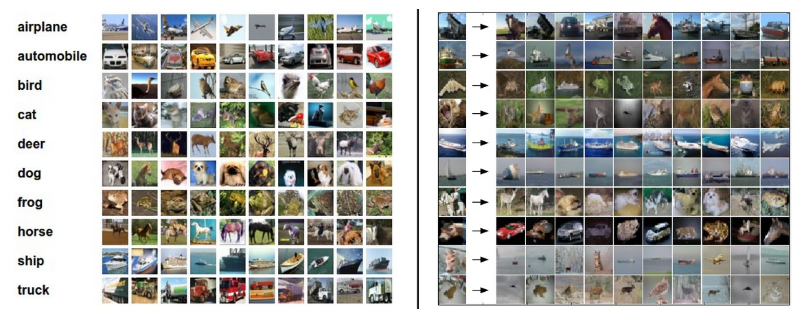

## CCS231n 第一节：图像分类问题
>Good good study, day day up.

[课程网站](https://cs231n.github.io/classification/)

学习分享基于**斯坦福李飞飞老师cs231n计算机视觉课程**  

[阅读材料](https://cs231n.github.io/classification/) 

# 0 图片分类问题 

图片分类问题，即从事先给定的一个类别组中，辨认选定输入图片的类别。  
这是计算机视觉的一个核心问题，且有很广泛的实际应用。  
许多计算机视觉的问题最终会简化为图片分类问题。 

**Example.** 假设有一个图片分类模型，它对于输入的三通道的图片会预测其属于 4 个标签（label）{cat， dog， hat， mug} 的概率。  

对于计算机来说，图像表示为一个大型的 3 维数字数组。在本示例中，cat 图像宽 248 像素，高 400 像素，具有三个颜色通道 Red、Green、Blue（简称 RGB）。因此，该图像由 248 x 400 x 3 ，共 297,600 个数字组成。每个数字都是一个范围从 0（黑色）到 255（白色）的整数。  

模型的任务就是接收这些数字，然后预测出这些数字代表的标签（label）,如 “cat”。  

# 1 数据驱动方法

## 1.1 Challenges

虽然图片识别对于容量来说平常简单，但是对于计算机来说，由于接受的是一串数字，对于同一个物体，对应表示这个物体的数字可能会有很大不同，所以通过算法来实现这一任务存在许多挑战，具体来说：

1. **观察角度变化 Viewpoint variation**：“不识庐山真面目，只缘身在此山中”。  
2. **尺度变换 Scale variation**：图片大小比例的变化也会使得数据发生改变。  
3. **变形 Deformation**：很多物体不是刚体，可以以极端方式变形，比如猫是液体。  
4. **遮挡 Occlusion**：要被识别的物体可能被遮挡，仅一部分可见。  
5. **光线条件 Illumination conditions**：环境光线的变化对图片的影响是巨大的。  
6. **背景干扰 Background clutter**：物体和背景可能有相似的颜色和纹路，使其很难被识别。  
7. **类内差异 Intra-class variation**：同一种类的物品可能外观差异很大。  

## 1.2 Data-driven approach

那么我们如何设计一种可以将图像分类为不同类别的算法？  
我们将大量带有类别标签的数据提供给计算机，开发学习算法模型来查看这些示例并了解每个类的视觉外观。这种方式就成为数据驱动方法，因为它依赖于一个带有标签的数据集合。  

所以通常图片识别任务的流水线如下：  
- **输入**：输入 $N$ 张图片，每张图像都标有 $K$ 个不同类别中的一个（图片的总类别数量为 $K$），我们称这一部分的数据为**训练集**。  
- **学习**：使用模型在训练集中学习，提取每一个类别的特征。我们将此步骤称为**训练分类器**或**学习模型**。  
- **评估**：最后，我们需要评估训练后这个模型的好坏。运用分类器预测一组以前从未见过的新图像的标签（保证类别也在 $K$ 类之中）来评估分类器的质量，我们将这些图像的真实标签与分类器预测的标签进行比较，期望分类正确的图片越多越好。    
   

# 2 Nearest Neighbor Classifier 最近邻域分类器

## 

首先我们来介绍一下最近邻域分类器，这个分类器与卷积神经网络无关，在实践中很少使用，但它可以让我们了解图像分类问题的基本方法。  

**Example.**  
本次使用的数据集是 [CIFAR-10](https://www.cs.toronto.edu/~kriz/cifar.html)，这是一个有名的公开图片数据集，由 60,000 张长和宽均为 32 像素的图片组成，一共有 10 个种类（如飞机、汽车、鸟等）。  
一般我们将其中的 50,000 张作为训练集， 10,000 张作为测试集，下图左就是 10 个类别的部分图片。  
  

现在我们的训练集中有 50,000 张图片（每个类别 5,000 张），对于测试集的 10,000 张图片，我们要做的是将其与训练集中的每一张图片进行比较，然后将该图片与训练集中最相似的图片归为一类。  
上图右就是部分图片分类后的结果，可以发现，存在很多的错误分类，原因在于虽然图片的种类不同，但是两种图片的颜色图案等非常相似，因此容易被归为一类。    

在最近邻域算法中，衡量两张图片是否相近的标准是什么呢？  
一种最简单的标准就是 **L1 距离** $L1$ $distance$（逐个像素地比较图片，然后把所有的差异相加）。  
假设我们将两张图片分别表示为两个向量 $I_1$, $I_2$，那么 $L1$ 距离 $L1$ $distance$的定义如下：  

$$d_1(I_1, I_2) = \sum_{p} |I_1^p - I_2^p|$$  

一个简单的计算流程演示：  
  

 对于两种图片的衡量标准还有 $L2$ 距离 $L2$ $distance$，定义如下：  
$$d_2(I_1, I_2) = \sqrt{\sum_{p} (I_1^p - I_2^p)^2}$$
