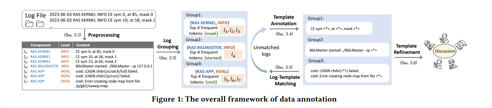

[2024]A Large-Scale Evaluation for Log Parsing Techniques: How Far Are We?

论文：<<A Large-Scale Evaluation for Log Parsing Techniques: How Far Are We?>>

下载地址：[paper](https://arxiv.org/abs/2308.10828)

github：[repo](https://github.com/logpai/loghub-2.0)

### bg

- 日志数据记录了软件运行时的信息，这对于理解软件系统的行为至关重要。一般来说，日志消息是半结构化的文本数据，由开发人员在源代码中编写的日志语句生成。具体来说，日志分析是从日志消息中提取不变的部分（即日志模板）和可变的部分（即日志参数）。传统方法通过将原始日志消息与源代码中的相应日志语句进行匹配来进行日志分析，但通常不切实际。因此，转而开发数据驱动的方法，直接处理原始日志消息，无需访问源代码。

- 鉴于各种日志分析工具采用了不同的技术，评估工具以理解其性能至关重要。发布的 Loghub 包含了由各种系统生成的大量日志数据集，提供了从每个系统中随机抽取的 2000 行日志的注释解析真实数据，称为 Loghub-2k。现有的日志分析工具在 Loghub-2k 数据集上报告了最先进的结果，但当工具被集成到现实世界的软件系统中时，其解析性能会受到影响。基于生产中自动化日志解析的经验，我们发现现有的解析器在识别两种类型的日志模板时存在困难：**不频繁的日志模板和参数密集的日志模板**。前者通常包括具有极高日志级别的日志（如错误或致命），这些日志因可能产生重大影响通常需要更多关注；后者通常记录系统运行状态和相关值。这两种类型的日志模板对于下游分析任务至关重要，然而，之前研究中报告的结果可能并不一定适用于实际生产环境，特别是对于这两种类型的数据。

- 这种性能差异主要源于现有基准研究中的三个固有限制。首先，**Loghub-2k 规模有限**。每个数据集仅包含 2000 行日志消息，而现实世界的数据通常包含数百万行日志。因此，Loghub-2k 可能无法充分代表从生产系统中获得的日志数据的复杂特性，特别是在日志模板的频率和参数数量方面。其次，**现有基准中使用的评估指标（例如，组准确率 GA）通常是消息级别的（即基于日志消息的数量计算），因此可能会产生误导性的高准确率结果**。这是因为在生产系统中，日志模板的出现通常是高度不平衡的。评估结果可能会被多数类别的日志模板（即包含大量日志消息的组）所主导。因此，这些指标可能不够稳健，无法应对具有不同模板分布的数据集。第三，现有研究通常报告日志解析器处理整个数据集的性能，**缺乏对具有不同特征的日志的细粒度分析**，不清楚它们在处理上述两种类型的日志模板时的表现如何，可能导致对特定案例在实践中表现的理解有限。

### 现有日志解析技术

现有文献提出了许多日志解析方法，主要分为以下四类：

- **基于频率的解析**：基于在特定日志数据集中频繁出现的标记通常代表这些日志的静态元素的假定。因此，提取频繁模版成为自动化日志解析的一种直接方法。具体来说，这类日志解析器首先遍历提供的日志数据集以构建频繁项集，随后利用这些项集推导出日志消息对应的日志模板。

- **基于相似性的解析**：将日志解析视为基于相似性将日志聚类成不同簇的问题，每个簇中的日志共享相同的日志模板。各种方法采用不同的聚类算法（如层次聚类、基于密度的聚类）和相似性的定义。在聚类过程之后，可以通过提取每个簇中日志的公共标记来推导出日志模板。

- **基于启发式的解析**：采用各种启发式算法或数据结构，如基于最长公共子序列的方法、解析树、进化算法等。这类日志解析器旨在利用日志数据的独特特性来区分日志消息中的模板和参数。

- **基于语义的解析**：近年来，许多解析器采用了深度神经网络来理解日志的语义含义，从而提高解析准确性。具体来说，这类日志解析器采用监督方法，使用双向长短时记忆网络或预训练语言模型等模型来学习日志消息的语义信息，从而通过完成分类任务来区分日志模板和参数。

### contributions

- 在原始 Loghub 日志的基础上，提出一个**新的大规模注释日志数据集集合 logHub-2.0**，旨在反映现实世界场景中观察到的日志数据的规模和分布，用于评估日志分析工具。集合包含 14 个数据集，每个数据集平均 360 万行日志（对 Loghub-2k 的扩展）。日志消息的解析标签通过严格的注释框架手动注释，**通过日志分组和模板匹配显著减少人工工作量**，以确保标签过程的效率和准确性。

- 提出了一个**更全面的日志分析工具基准测试协议**，强调对具有不同特征的日志进行解析准确性的评估。同时提出了一个新的**模板级指标 FGA**，以解决现有指标对不平衡数据的敏感性问题。同时**首次研究了日志解析器在具有不同频率和参数数量的日志模板上的性能**，为它们在生产环境中的表现提供了重要的参考。

- 通过论文提出的基准测试协议**重新评估**了 15 个最先进的日志分析工具，并得出了**7个有趣发现**，这些发现可能会为在更实际的环境中设计和评估日志解析器提供启示。为促进未来研究，同时公开提供数据集、源代码和实验结果。

### 数据集构建的过程

为构建数据集，从 Loghub 中选择了 14 个日志数据集，数据集涵盖不同类型系统，包括分布式系统、超级计算机和操作系统。由于缺乏日志解析评估所需的标签，研究的一个必要初步步骤是对这些数据集进行注释。鉴于数据集规模庞大，设计了一个严格注释框架来协助注释过程，该框架通过日志分组和模板匹配确保标记的效率和准确性，包括**五个步骤：预处理、日志分组、模板注释、日志模板匹配和模板细化**。首先，对原始日志进行预处理以获取有意义的日志内容。然后，采用分层方法将日志粗略地划分为不同的组。共享相同模板的日志消息很可能会被划分为同一组，这有助于高效地进行注释过程。在每个组内，标注员仔细识别所有日志模板。在此过程中将每个组内的日志消息按字典顺序排列，以便将相似的日志消息放在一起，快速标注所有日志模板。注释完成后，使用正则表达式构建日志消息与标注日志模板之间的匹配。如果仍有日志消息未匹配，将重新审查并修正模板，然后重复匹配过程，直到所有日志消息都匹配。最后，进行模板细化，以校准所有标注员的结果，确保所有标注员和数据集之间的标注准确性和一致性。

- **预处理**：首先应用**预定义的正则表达式**提取日志消息的不同字段。典型字段包括时间戳、日志级别、组件和内容。然后对日志进行清理过程。该过程特别针对那些内容中不包含任何字母字符的日志，如仅由数字或标点符号组成的日志（缺乏可解析内容），同时移除具有重复内容的日志行，以减少后续手动标注的工作量。

- **日志分组**：在预处理阶段后仍面临大量日志消息，对每条消息进行手动标注不切实际。采用分层方法将日志消息粗略地划分为多个组。目标是将共享相同模板的日志消息分到同一组，以便能够一次性标注它们的模板。为此，首先根据日志级别和组件名称对日志进行划分，这些属性在预处理步骤中提取。这两个属性提供了一种直接的方法来初步识别属于同一模板的日志。其次，使用更高级的信息来对日志进行分组，即日志消息中最频繁出现的标记。具体来说，使用空格和标点符号等分隔符将每条日志消息分解为多个标记，并计算每个标记在数据集中的频率。对于每条日志消息，我们计算其 K 个最频繁的标记，然后将共享常见 K 个最频繁标记的日志消息分到一起。其背后的原理是，日志消息的模板部分保持稳定，而参数部分可以在运行时动态变化。因此，日志消息中最频繁的 K 个标记可以有效地作为确定它们属于同一组的有力证据。每个数据集的 K 值是根据其特征确定的，范围从 1 到 3。特别是，我们维护了一个停用词集合，以从 K 个最频繁标记中排除这些常见词，以确保这些词不会干扰分组过程。除了 Scipy 库提供的停用词外，我们手动添加了一些词，如 root、true 等。最后获得了多个粗粒度的日志消息组，其中每个组中的日志消息共享相同的日志级别、组件和 K 个最频繁标记。

- **模板注释**：日志分组步骤的目标是将日志划分到粗粒度的组中，尽可能确保共享相同模板的日志被分到同一组。因此，不同模板的日志消息可能会被分到同一组。为解决这个问题，采用手动模板注释从每个组中推导出真实的日志模板。为加快手动注释过程，将每个组内的日志消息按字典顺序排列，以便将相似的日志消息放在一起。标注员可以根据日志的结构和相似性快速识别模板。因此，标注员只需要标注真实的日志模板，无需对每条日志消息进行顺序标注。这种方法基于这样的观察结果：潜在的日志模板数量通常比日志消息的总数少几个数量级，这使得手动标注变得可行。具体来说，所有标注员独立进行手动注释过程，其个人结果将被整合以生成最终结果。为确保注释的准确性和一致性，我们遵循 Li 等人提出的参数类别来确定一个标记是否是参数。同时要求标注员应用 Khan 等人提出的相同启发式规则，以确保更一致的模板格式，如用单个空格替换双空格。如果一个标记被识别为参数，将用 “<*>” 替换它，而静态部分保持不变以形成相应的模板。由于相似的日志消息已经被分组并排序在一起，可以跳过许多明显共享相同模板的日志消息，而只需记录识别出的模板。最后，在极少数情况下，不同组仍然共享相同的模板，我们比较从不同组中得出的模板，消除重复的模板，并在必要时合并一些模板。这个过程可以消除日志分组步骤中的潜在错误，从而确保模板的准确性。

- **日志模板匹配**：尽管在手动注释步骤中生成了日志模板，但没有记录每条日志消息与其对应模板之间的显式匹配。这是为了避免使注释过程复杂化，并且在后续的可能的去重和合并过程中，可能会导致关系模糊和维护清晰度与准确性方面的挑战。我们求助于**正则表达式技术来自动构建日志和模板之间的匹配**。具体来说，将每个模板转换为正则表达式，通过将 “<>” 替换为 “(.)”，使每个参数位置能够匹配任意长度的字符串。随后，对于每条日志消息，尝试将其与每个日志模板进行匹配，直到找到匹配项为止。尽管这一步需要在大量日志消息和日志模板之间进行成对匹配，但由于日志模板的数量通常远小于日志消息的总数，因此可以在合理的时间内完成。同时通过并行方式实现这一匹配过程，进一步加快了匹配速度。此外，在匹配过程中，一条日志消息可能匹配多个模板。如，两个模板 T1：“auth failure;logname=<>uid=<>ruser=<>” 和 T2：“auth failure;logname=<>uid=<>”可能存在于同一数据集中。所有由模板 T1 生成的日志消息都可以被 T2 匹配，因为最后一个 “<>” 允许匹配多个标记。为了解决这个问题，当一条日志消息匹配多个正则表达式时，我们优先选择具有更长静态部分的模板进行注释。其直觉是，当两个不同的模板能够匹配同一条日志消息时，能够匹配更多非 “<>” 字符的模板表明这条日志消息更有可能属于该特定模板。在极少数情况下，如果两者相同，我们选择具有更少“<>”的模板以生成更紧凑、更简单的模板。通过应用这一规则，T1 的日志消息将正确地与 T1 匹配。如果特定的日志消息未能匹配任何正则表达式，将返回到模板注释步骤，仔细审查这些日志消息，对模板进行必要的修正，然后重复匹配过程。最终，每条日志消息都应该成功匹配一个正则表达式，对应于其标注的模板。

- **模板细化**：最后一步是模板细化，旨在整合五名标注员的结果并纠正潜在错误。在仔细比较五名标注员的模板后，确定了以下最常出现的不一致情况。所有差异都通过讨论解决，以确保标注的准确性和一致性。一名标注员可能产生的模板比其他人多：其一些标注模板可能过于具体，如某些变量（例如，root/True/temp）错误地被识别为常量，我们将这些情况视为参数。相同的模板可能具有不同的格式：如 “1165bytes (1.13KB) sent” 可能被标注为 “<>bytes (<>KB) sent” 或 “<>bytes <> sent”，在这种情况下，我们选择前者以保留日志的原始格式。此外，我们通过确定五名标注员的标注完全相同的模板比例，定量评估五名标注员的标注一致性。所有数据集的平均一致性得分达到 0.926，表明在标注步骤中高度一致。最终，五名标注员就所有标注模板达成一致，这被采纳为最终结果。

- **注释结果**：数据注释过程最终产生了一个名为 Loghub-2.0 的大规模日志解析数据集集合，涵盖了多种系统。与 Loghub-2k 相比，Loghub-2.0 中标注的日志消息平均数量大幅增加，从 2000 条增加到 3601187 条，增长了 1875 倍。此外，标注的日志模板平均数量增加了 204.2%，从 81.9 个增加到 249.1 个，涵盖了更广泛的模板。Loghub-2.0 的大规模数据集使得对日志解析技术进行详细评估成为可能，可能会暴露出它们在更现实和大规模场景下的性能表现。

### 评估指标

我们使用两类指标，即消息级和模板级指标来评估日志解析器。消息级指标考虑每个模板的日志消息数量，因此倾向于具有更多日志消息的模板；模板级指标平等地考虑每个模板，而不考虑每个模板对应的日志消息数量。在我们的基准协议中，我们采用了两个消息级指标，组准确率（GA）和解析准确率（PA），以及两个模板级指标，组准确率的 F1 分数（FGA）和模板准确率的 F1 分数（FTA）。特别是，FGA 是我们提出的，它是 GA 的模板级版本。

#### 消息级指标

- **组准确率（GA）**：GA 首次由 Zhu 等人使用，用于评估正确分组属于同一模板的日志消息的能力。定义为正确分组的日志消息数量与总日志消息数量的比例。只有当一条日志消息的模板与真实情况中同一组的日志消息相对应时，才认为该日志消息被正确分组。

- **解析准确率（PA）**：PA 由 Dai 等人使用，用于评估正确提取每个日志消息的模板部分和参数部分的能力，这对于诸如使用参数值进行异常检测等各种日志分析任务至关重要。定义为正确解析的日志消息数量与总日志消息数量的比率，只有当一条日志消息的所有静态模板标记和动态变量都被正确识别时，才认为该日志消息被正确解析。

#### 模板级指标

- **组准确率的 F1 分数（FGA）**：我们提出了 FGA，它关注正确分组的模板比例，而不是日志消息。因此，它可以被视为在模板级别计算 GA。具体来说，FGA 是组准确率精度（PGA）和组准确率召回率（RGA）的调和平均值。设 \( N_p \) 为日志解析器生成的模板数量，\( N_c \) 为日志解析器正确解析的模板数量。这里的“正确”与 GA 中的定义相同，即如果一个日志模板所属的日志消息集合与真实情况中指示的集合相匹配，则认为该模板被正确解析。\( N_g \) 是真实情况中正确的模板数量。根据这些符号，我们可以定义 PGA 为 \( \frac{N_c}{N_p} \)，RGA 为 \( \frac{N_c}{N_g} \)。然后，我们可以计算 FGA 为它们的调和平均值，即 \( \frac{2 \times PGA \times RGA}{PGA + RGA} \)。

- **模板准确率的 F1 分数（FTA）**：FTA 是由 Khan 等人提出的模板准确率召回率（RTA）和模板准确率精度（PTA）的调和平均值。FTA 与 FGA 在“正确识别”的定义上有所不同，我们定义一个新的符号 \( \hat{N}_c \) 来表示日志解析器正确识别的模板数量。对于 FTA，只有同时满足以下两个条件时，才认为一个模板被正确识别：(1) 解析的模板对应的日志消息集合与真实模板相同；(2) 模板的所有标记与真实模板的标记相同。然后，我们可以定义 PTA 为 \( \frac{\hat{N}_c}{N_p} \)，RTA 为 \( \frac{\hat{N}_c}{N_q} \)。FTA 可以计算为它们的调和平均值，即 \( \frac{2 \times PTA \times RTA}{PTA + RTA} \)。与 FGA 相比，FTA 更关注识别特定日志消息的具体常量和参数部分的能力。

### 研究问题与研究结果

基于 Loghub-2.0 的大规模和多样性，我们首先设计了三个研究问题来指导研究，旨在更深入地了解日志解析器在现实世界应用中的有效性和适用性。

- **RQ1: Loghub-2.0 和 Loghub-2k 之间有什么区别？** 在这个研究问题中，我们的目标是探索 Loghub-2.0 和 Loghub-2k 之间的数据特征是否存在显著差异，这些差异可能会对日志解析器的性能产生影响。具体来说，我们关注两个重要的特征：日志模板的频率和日志模板中的参数数量。
- **RQ2: 日志解析器在 Loghub-2.0 上的性能与在 Loghub-2k 上相比如何？** 在这个研究问题中，我们的重点是对日志解析器使用 Loghub-2.0 进行全面的重新评估，涵盖有效性和效率两个方面。我们还探索了广泛使用的 Loghub-2k 可能存在的潜在局限性。为此，我们仔细比较了从 Loghub-2.0 获得的评估结果与从 Loghub-2k 获得的结果，使我们能够得出有洞察力的结论。
- **RQ3: 日志解析器在具有不同特征的日志上的性能如何？** 我们研究日志解析器在具有不同模板频率和参数数量的日志上的性能。这一点至关重要，因为某些具有独特特征的日志在生产环境中可能具有重要意义。特别是，只有使用 Loghub-2.0 中的标记数据集，这种评估才成为可能，这归功于它的大规模和多样性。

#### RQ1: Loghub-2.0 和 Loghub-2k 之间的差异

- 发现 1：Loghub-2k 和 Loghub-2.0 中日志模板频率和参数数量的分布存在显著差异。特别是，Loghub-2.0 展现出更明显的模板频率不平衡。此外，与 Loghub-2k 中的模板相比，Loghub-2.0 包含更多的模板，且每个模板平均具有更多的参数。

#### RQ2: 日志解析器在 Loghub-2.0 和 Loghub-2k 上的性能差异

- 发现 2：由于消息级指标（如 GA 和 PA）对不平衡的日志数据比较敏感，因此它们通常比模板级指标（如 FGA 和 FTA）产生更高的评估结果。在规模更大的 Loghub-2.0 中，这些指标之间的差异更为明显，Loghub-2.0 展现出更大的模板频率不平衡。

- 发现 3：在 Loghub-2k 上获得的评估结果并不总是在将日志解析器应用于大规模 Loghub-2.0 时保持一致。在 Loghub-2.0 上，现有解析器的性能下降，并且所有指标的方差增加。

- 发现 4：基于语义的日志解析器在解析单条日志方面更具能力，这体现在它们更高的 PA 和 FTA 上。然而，由于它们忽视了全局信息，它们在分组相关指标上表现出较低的分数。此外，这些日志解析器的性能可能在 Loghub-2.0 中的更大和更多样化的数据集上下降，尤其是当用于训练的标注样本数量有限时。

- 发现 5：15 种日志解析器中有 9 种无法在合理的 12 小时时间范围内处理完 Loghub-2.0 中的所有 15 个数据集。此外，基于语义的方法通常比基于统计的方法需要更多的计算资源。

#### RQ3: 不同特征日志上的日志解析器性能

- 发现 6：现有日志解析器在处理不同频率的模板时表现出不同的有效性。它们通常在频繁模板上实现较低的 GA 和 FGA，因为对于包含更多日志消息的模板，分组更具挑战性。此外，它们在不频繁模板上实现较低的 PA 和 FTA，因为可用的证据（例如，训练数据）较少，用于指导每条日志消息的准确解析。

- 发现 7：尽管日志解析器在完整数据集上实现了高分，但它们在处理参数密集型日志时的解析有效性仍然令人不满意。

#### 总结

- 我们提出的用于日志解析的大规模数据集集合 Loghub-2.0 与常用的 Loghub-2k 相比，展现出日志数据的显著不同特征，特别是在日志模板频率和参数数量的上下文中。由于其更大的规模和更复杂的特征，Loghub-2.0 对现有日志解析器提出了更大的挑战。

- 我们的评估结果表明，Drain 是最具性能的解析器，它在分组日志消息方面更具能力，这体现在最高的平均 GA 和 FGA 上。另一方面，基于语义的方法（例如，UniParser 和 LogPPT）在区分每个标记是常量还是动态部分方面展现出更强的能力。然而，这些方法在分组具有相同模板的日志消息方面的有效性受到影响。这是因为标记分类错误很容易导致不完整的分组。

- 所有现有解析器在 Loghub-2.0 上的表现与 Loghub-2k 相比都有显著下降，且差异更大，这表明我们提出的数据集和基准测试协议能够在更复杂和多样化的条件下揭示日志解析器的性能。这在解析不频繁日志和参数密集型日志时尤为明显，表明在整个数据集上实现高整体性能，并不一定保证对不频繁和参数密集的日志进行有效解析。因此，全面评估应考虑不同类型的日志，以确保在实践中具有稳健和可靠的性能。

- 大多数日志解析器的效率无法满足大规模应用场景的需求。15 种解析器中有 9 种未能在合理时间内处理 Loghub-2.0 中的所有数据集，突显了提高解析效率的重要性，特别是对于生产部署。

### Implications

- **综合考虑两种层面的指标**：尽管大多数现有任务利用消息级指标（如 GA 和 PA）来评估性能，但在大规模应用场景中，这些指标通常被高频日志模板所主导，从而产生较高的分数。相比之下，模板级指标对模板频率的不平衡具有抵抗力，因此能够准确反映具有多样化模板分布的数据集上的解析性能。因此，这两种类型的指标可以结合起来考虑，并且可以根据具体需求优先考虑其中一种。例如，如果更关注高频日志模板的解析准确性，并且可以容忍不频繁模板的错误，那么消息级指标更为合适，反之亦然。

- **针对不同特征的日志评估性能**：尽管某些日志解析器在特定数据集上表现出较高的整体性能，但在处理不频繁和参数密集型日志模板时，其解析性能仍然不足。考虑到这些日志的重要性，专注于这些日志的性能至关重要。我们提出的评估协议可以更全面地挖掘日志解析器在这些日志模板上的性能。因此，未来的研究在设计新的日志解析器时应关注这一方面，从而增强它们在现实世界中的适用性。

- **更加重视效率**：许多现有的日志解析器未能满足大规模应用场景的性能要求，这一事实并未在 Loghub-2k 中得到体现。考虑到实际环境中日志的大量产生，未来的日志解析器必须被设计为能够满足特定的性能需求。

- **尝试结合语义和统计信息**：根据发现 4，基于语义的日志解析器在区分参数和模板方面具有更强的能力，这也证实了语义信息在日志解析过程中的重要性。然而，由于忽视了全局信息，它们的分组能力受到影响。这是不可避免的，因为这些日志解析器仅独立处理每条日志消息。未来研究的一个潜在方向可能是将日志中的语义和统计信息结合起来，从而同时提高解析和分组的能力。

### Threats to Validity

- Annotation errors 
- Limited log parsers 
- Implementation and settings 

### Pros & Cons

#### Pros

- 

#### Cons

- 
